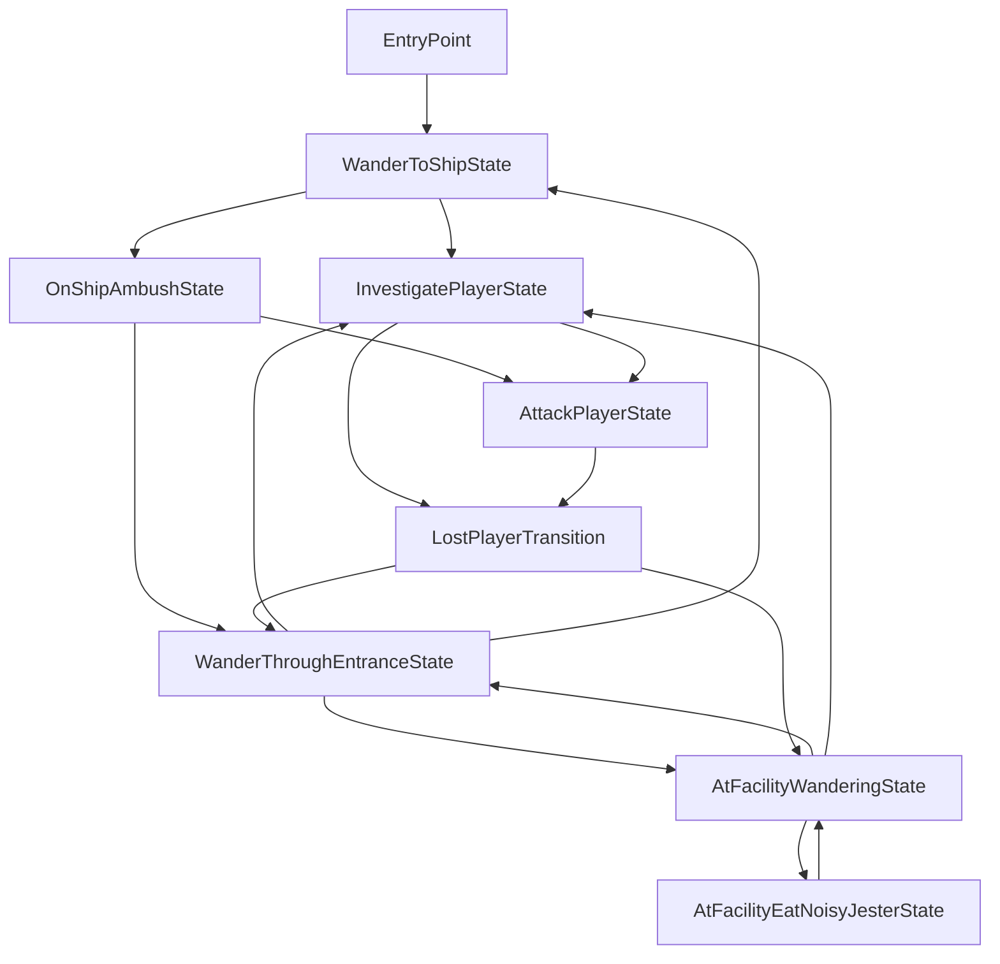

# SCP-682

> [!NOTE]  
> This readme is for developers.  
> See the readme for players [here](./Plugin/Thunderstore/README.md).

An enemy mod for Lethal Company.

## Contributing

This is a readme modified from the LC-ExampleEnemy project and adjusted for this project, so you can follow this brief guide. However, there are some things to know as a developer of this project:

- This project is based off of the [live-reload](https://github.com/Hamunii/LC-ExampleEnemy/tree/live-reload) branch of LC-ExampleEnemy.
  - This means you can install and configure BepInEx.Debug [ScriptEngine](https://github.com/BepInEx/BepInEx.Debug?tab=readme-ov-file#scriptengine) and make sure your built DLL files go to `BepInEx/scripts`, as that's where ScriptEngine expects them to be.
  - ⚠️ To make sure ScriptEngine works, set the following setting in BepInEx/config/BepInEx.cfg: `HideManagerGameObject = true`.
  - Also check the ScriptEngine's configuration file for important settings and keybindings.
- With the *DEBUG* build configuration, networking functionality is disabled from *our scripts* to avoid possible issues due to live reloading. For testing multiplayer, make builds using the *RELEASE* configuration.
- Due to how ScriptEngine works, we can't add the AI script in Unity, we must add it programmatically.
- When the mod is reloaded with ScriptEngine, it will spawn the enemy in front of you automatically. Unloading it will remove all game objects with the *now old* AI script. The asset bundle is also reloaded when a reload happens, so you can also work in Unity without having to restart the game.

Also, this project is made on Unity 2022.3.49f1 because it doesn't constantly crash on Linux on Vulkan on Nvidia drivers above version 545. Anyways, everything should still work if you change the Unity version upon boot.

## Setting Up The Project For Development

### Setup Script

After copying this repo for yourself, run [SETUP-PROJECT.py](/SETUP-PROJECT.py) from the command-line like this: `python SETUP-PROJECT.py` (Or you can run it from your file manager on Linux). Note that you will have to have Python installed.

- First, the setup project will copy DLL files over to `UnityProject/Assets/Plugins` directory so we can build our Asset Bundles without any errors.
- Second, it will run `dotnet tool restore` in the `Plugin` folder to locally install Unity Netcode Patcher & Thunderstore CLI.
- Third, it will ask you to paste a path to where it will copy over your mod files when you build your project. This is done by generating a `csproj.user` file with the path you inputted. After this, the setup process is done.
- If the script closes instantly after opening it, it means it crashed. This is actually the reason why I told to run it from the command-line. If you use Windows and can make this work, please open a pull request to fix this, thanks!
  - If the script still crashes after running from command-line, try making sure you are running Python 3.

This is the [SCP682.template.props.user](/Plugin/SCP682.template.props.user) template which is also generated by the setup script:

```xml
<Project>

    <PropertyGroup>
        <!-- The path to the game files -->
        <GameDirectory>%programfiles(x86)%/Steam/steamapps/Common/Lethal Company/</GameDirectory>
        <!-- The path to plugins directory -->
        <PluginsDirectory>/my/path/to/BepInEx/plugins/</PluginsDirectory>
        <!-- The path to where the assmeblies get copied to -->
        <TestingDirectory>$(PluginsDirectory)../scripts/</TestingDirectory>
    </PropertyGroup>

</Project>
```

### Dependencies

You need to install the following mods for BepInEx for this mod to work in the game (these are not installed by the setup script):

- [LethalLib](https://thunderstore.io/c/lethal-company/p/Evaisa/LethalLib/) for registering and adding our enemy.
    - LethalLib depends on [HookGenPatcher](https://thunderstore.io/c/lethal-company/p/Evaisa/HookGenPatcher/).
- [ModMenuAPI](https://github.com/Hamunii/ModMenuAPI/releases) which is used with the `DEBUG` configuration for debug functionality like setting the state of the enemy. (This is not on Thunderstore quite yet)

If you didn't run the setup script you will also need to, in the `Plugin` directory where our plugin code is, run `dotnet tool restore` on the command-line to install the rest of the dependencies.

That should be all the required setup for this project. Good luck!

### Thunderstore Packages

We have configured [SCP682.csproj](/Plugin/SCP682.csproj) to build a Thunderstore package to [/Plugin/Thunderstore/Packages/](/Plugin/Thunderstore/Packages/) using [tcli](https://github.com/thunderstore-io/thunderstore-cli/wiki) each time we make a release build of our mod. A release build can be done for example from the command-line like this: `dotnet build -c release`. This will use configuration options from [thunderstore.toml](/Plugin/Thunderstore/thunderstore.toml). Do note that we have not included a way to upload your mod to thunderstore via tcli in this project.

## Credits

See the credits [here](./Plugin/Thunderstore/README.md#credits).

## License

All assets located at [/UnityProject/Assets/ModAssets/](/UnityProject/Assets/ModAssets/) are all rights reserved, and are owned by JoeJoe.  
The code for this project, located in [/Plugin/](/Plugin/) is licensed under the [MIT License](/Plugin/LICENSE).

## Enemy States Graph

Here's a basic graph of the enemy's states to help understand it better:
> This graph was last updated 2024-6-9.  
> Currently slightly inaccurate. (2024-9-29)


