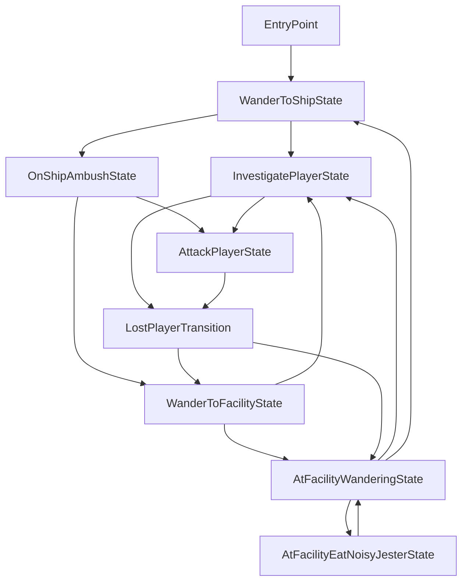

# SCP-682

> [!NOTE]  
> This readme is for developers.

An enemy mod for Lethal Company.

## Contributing

This is a readme modified from the LC-ExampleEnemy project and adjusted for this project, so you can follow this brief guide. However, there are some things to know as a developer of this project:
- This project is based off of the [live-reload](https://github.com/Hamunii/LC-ExampleEnemy/tree/live-reload) branch of LC-ExampleEnemy.
  - This means you can install and configure BepInEx.Debug [ScriptEngine](https://github.com/BepInEx/BepInEx.Debug?tab=readme-ov-file#scriptengine) and make sure your built DLL files go to `BepInEx/scripts`, as that's where ScriptEngine expects them to be.
  - ⚠️ To make sure ScriptEngine works, set the following setting in BepInEx/config/BepInEx.cfg: `HideManagerGameObject = true`.
  - Also check the ScriptEngine's configuration file for important settings and keybindings.
- With the *DEBUG* build configuration, networking functionality is disabled from *our scripts* to avoid possible issues due to live reloading. For testing multiplayer, make builds using the *RELEASE* configuration.
- Due to how ScriptEngine works, we can't add the AI script in Unity, we must add it programmatically.
- When the mod is reloaded with ScriptEngine, it will spawn the enemy in front of you automatically. Unloading it will remove all game objects with the *now old* AI script. The asset bundle is also reloaded when a reload happens, so you can also work in Unity without having to restart the game.

Also, this project is made on Unity 2022.3.20f1 because I had issues with getting Unity working at all. Anyways, everything should still work if you change the Unity version upon boot.

## Setting Up The Project For Development

### Setup Script

After copying this repo for yourself, run [SETUP-PROJECT.py](/SETUP-PROJECT.py) from the command-line like this: `python SETUP-PROJECT.py` (Or you can run it from your file manager on Linux). Note that you will have to have Python installed.  
- First, the setup project will copy DLL files over to `UnityProject/Assets/Plugins` directory so we can build our Asset Bundles without any errors.
- Second, it will run `dotnet tool restore` in the `Plugin` folder to locally install Unity Netcode Patcher & Thunderstore CLI.
- Third, it will ask you to paste a path to where it will copy over your mod files when you build your project. This is done by generating a `csproj.user` file with the path you inputted. After this, the setup process is done.
- If the script closes instantly after opening it, it means it crashed. This is actually the reason why I told to run it from the command-line. If you use Windows and can make this work, please open a pull request to fix this, thanks!
    - If the script still crashes after running from command-line, try making sure you are running Python 3.

This is the [SCP682.template.csproj.user](/Plugin/SCP682.template.csproj.user) template which is also generated by the setup script:
```xml
<?xml version="1.0" encoding="utf-8"?>
<Project ToolsVersion="Current" xmlns="http://schemas.microsoft.com/developer/msbuild/2003">
    <PropertyGroup>
        <GameDirectory>%programfiles(x86)%/Steam/steamapps/Common/Lethal Company/</GameDirectory>
        <!-- Paste a path to where your mod files get copied to when building.  Include the last slash '/' -->
        <PluginsDirectory>/my/path/to/BepInEx/scripts/</PluginsDirectory>
    </PropertyGroup>

    <!-- Game Directories - Do Not Modify -->
    <PropertyGroup>
        <ManagedDirectory>$(GameDirectory)Lethal Company_Data/Managed/</ManagedDirectory>
    </PropertyGroup>
    
    <!-- Our mod files get copied over after NetcodePatcher has processed our DLL -->
    <Target Name="CopyToTestProfile" DependsOnTargets="NetcodePatch" AfterTargets="PostBuildEvent">
        <Copy SourceFiles="$(TargetPath)" DestinationFolder="$(PluginsDirectory)"/>
        <!-- We will copy the asset bundle named "modassets" over -->
        <Copy SourceFiles="../UnityProject/AssetBundles/StandaloneWindows/scp682assets" DestinationFolder="$(PluginsDirectory)"/>
        <Exec Command="echo '[csproj.user] Mod files copied to $(PluginsDirectory)'" />
    </Target>
</Project>
```

### Dependencies

You need to install the following dependencies for this mod to work in the game (these are not installed by the setup script):

- [LethalLib](https://thunderstore.io/c/lethal-company/p/Evaisa/LethalLib/) for registering and adding our enemy.
    - LethalLib depends on [HookGenPatcher](https://thunderstore.io/c/lethal-company/p/Evaisa/HookGenPatcher/).

If you didn't run the setup script you will also need to, in the `Plugin` directory where our plugin code is, run `dotnet tool restore` on the command-line to install the rest of the dependencies.

That should be all the required setup for this project. Good luck!

### Thunderstore Packages

We have configured [SCP682.csproj](/Plugin/SCP682.csproj) to build a Thunderstore package to [/Plugin/Thunderstore/Packages/](/Plugin/Thunderstore/Packages/) using [tcli](https://github.com/thunderstore-io/thunderstore-cli/wiki) each time we make a release build of our mod. A release build can be done for example from the command-line like this: `dotnet build -c release`. This will use configuration options from [thunderstore.toml](/Plugin/Thunderstore/thunderstore.toml). Do note that we have not included a way to upload your mod to thunderstore via tcli in this project.

## Credits

This project is based off of the [LC-ExampleEnemy](https://github.com/Hamunii/LC-ExampleEnemy) template by [Hamunii](https://github.com/Hamunii), which is MIT licensed. Also see the [LC-ExampleEnemy Credits](https://github.com/Hamunii/LC-ExampleEnemy?tab=readme-ov-file#credits).

- JoeJoe - Project leader
- [Hamunii](https://github.com/Hamunii) - Programming
- [SkullCrusher/Skull220](https://github.com/Skull220) - Creator of the WTOEnemy class which is for their project [Welcome To Ooblterra](https://thunderstore.io/c/lethal-company/p/Skeleton_Studios/Welcome_To_Ooblterra/), and is the base of this project's [ModEnemyAI](/Plugin/src/Enemy/ModEnemyAI.cs) class
- DBJ - Voice of SCP-682
- s1ckboy - Sounds (coming soon(tm))

## Enemy States Graph

This graph was made 2024-6-6.

